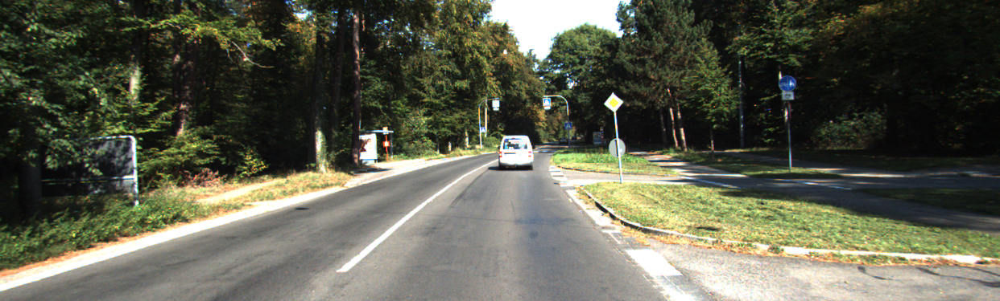
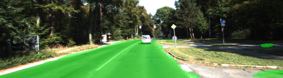
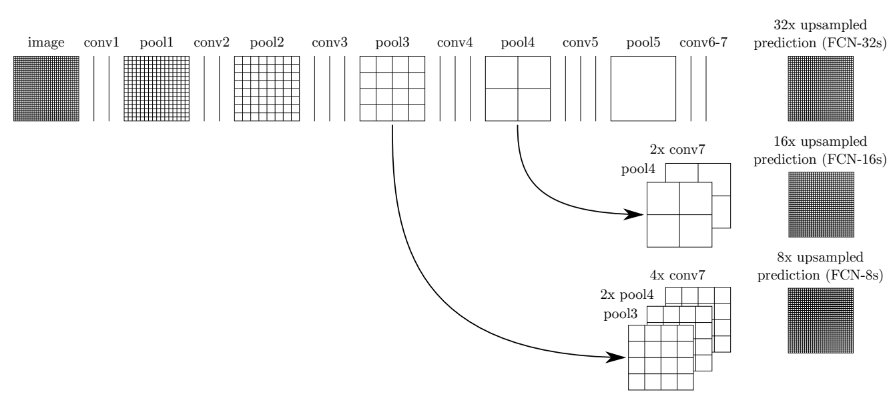
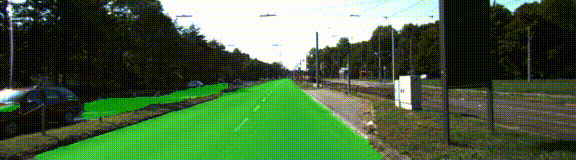

# CarND Semantic Segmentation

## Overview

The goal of this project was to split up an automotive video into individual camera frames and paint each pixel of each frame using a Fully Convolusional Network (FCN). Each pixel is classified as either 'road' or 'not road' to help other systems in the car to determine where the space is. Following the [walkthrough](https://www.youtube.com/watch?time_continue=1486&v=5g9sZIwGubk) and [rubric](https://review.udacity.com/#!/rubrics/989/view) for this project, the goal is to become familiar with how to apply segmantic segmenation to a real world application.

Follow the [installation guide](https://github.com/djiglesias/CarND-Semantic-Segmentation/blob/master/INSTALL.md) for installing the required system dependencies, and download the [labelled data set](http://www.cvlibs.net/download.php?file=data_road.zip) for training the model. To begin training your model just open a terminal, navigate to this project folder, and run `python3 main.py`. Using an existing VGG model we can train the network to identify two classes, CAR and NOT CAR, which we will use to paint each pixel the respective (green in this case).

 
 

## Implement Training Functions

For this project we are using a pre-trained VGG model that follows the `FCN-8 architecture` as described in the paper from Berkley [HERE](https://people.eecs.berkeley.edu/~jonlong/long_shelhamer_fcn.pdf).

 

### Load VGG
Load the frozen VGG16 model with all its layers and weights into the program so that we can adjust the settings for our application. With this model we can retrain the network for a completely new topic which will be CAR/NOT CAR in this project. From this function, we want to load layer 3, layer 4, and layer 7 from the model return these for use layer in the encoder.

### Create the Model Layers
Following the network architecture we build the decoder for the layers to add in skip connections and pooling layers to upsample the data to the correct size. In order to avoid over fitting of our data we add in an `l2_regularizer` and adjust the `keep_prob` terms. We build backwards from layer 7 to layer 4 to layer 3 to reconstruct the model and return the final layer from the function.

- Layer 7 --> 1x1 Convolution
- Layer 4 --> Upsample
- Layer 4 --> 1x1 Convolution
- Layer 4 --> Skip Connection
- Layer 3 --> Upsample
- Layer 3 --> 1x1 Convolution
- Skip Connection
- Upsample

### Optimize

This functon builds the TensorFlow loss and sets the optimizer as AdadeltaOptimizer with minimizing cross entropy loss. The returns from this function are the logits and the cross entropy loss.

## Train the Neural Network

This function handles running the TensorFlow session for the number of epoches specified by the input parameters of the function and runs the session each time using the learning rate, keep probability, cross entropy loss, and batch size passed in.

## Run

Now let's run our model and paint images with the regions classified as ROAD as green. The better our classifier worked, the less noise our images will have. The results below were obtained using the following parameters:

- Epochs: 40
- Batch Size: 5
- Keep Probability: 0.5
- Learning Rate: 0.0009

Navigate to the folder within `runs` that contains the post-processed images from `main.py` and run the following commands using `ffmpeg` to first generate an MP4 video and then convert it to a GIF.

    $ ffmpeg -r 10 -f image2 -i um_%06d.png -vcodec libx264 -crf 0 -pix_fmt yuv420p test.mp4
    $ ffmpeg -i test.mp4 out.gif

 

